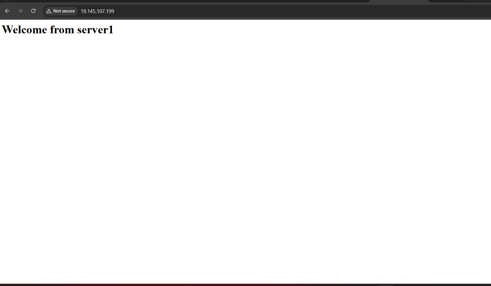
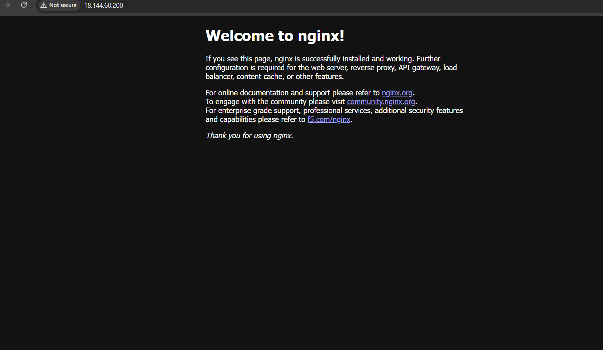
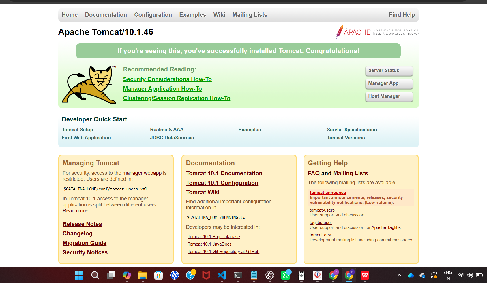

# Ansible Automation Project

Automated deployment and configuration of Apache, Nginx, and Tomcat servers on AWS EC2 using Ansible.

## Project Architecture

- Control Node: Ansible installed
- Server1: Apache Web Server
- Server2: Nginx Web Server
- Server3: Tomcat Application Server

## Technologies Used

- AWS EC2
- Ansible
- Linux
- YAML
- SSH
- Apache
- Nginx
- Apache Tomcat

## Implementation

- Configured Ansible Control Node
- Managed multiple servers using inventory file
- Created playbooks for Apache, Nginx, and Tomcat
- Used handlers for service restart
- Used Jinja2 templates for website deployment
- Automated software installation and configuration

## Execution

Run the complete automation:

```bash
ansible-playbook site.yml

## Output Screenshots

### Ansible Connectivity Test



### Ansible Playbook Execution



### Server Deployment Result




